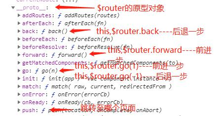

### 介绍
第一个VUE项目，实现了商品购买、新闻阅读、图片浏览、评论等功能

#### 插件
+ vuex - Vue数据仓库
+ vue-router - Vue路由模块
+ VuePreview - 图片预览插件
+ moment - 时间格式化插件
+ axios - HTTP库
+ qs - 参数序列化插件
#### UI组件
+ VantUI
+ MintUI
+ MUI

### 日志：
#### 制作首页组件
1. 完成Header区域使用的是Mint-UI中的Header组件
2. 制作底部的Tabbar区域使用的是vantUI中的Tabbar
	+ 需注意[router-link linkActiveClass属性](https://blog.csdn.net/Little_Flower/article/details/88316639)
3. 在页面中间放置一个router-view来展示路由匹配到的组件

#### 改造tabbar为router-link
1. 将\<a>标签改为\<router-link>标签
2. 将href属性改为to属性

#### 设置路由高亮
1. 在路由对象中新增linkActiveClass属性
2. 使用'mui-active'样式替换默认路由高亮样式

#### 完成点击tabbar切换组件
1. 创建四个组件模板
2. router.js中引入对应路由组件
3. 配置路由规则
4. 根组件App.vue中中间区域添加router-view容器

#### 制作首页轮播图
1. 使用Mint-UI中的swipe组件
2. 加载轮播图数据
	+ 使用vue-axios获取数据this.axios.get
	+ 获取到的数据保存到data中
	+ 使用v-for循环渲染组件每个item
*注意事项
组件中使用v-for必须添加key属性

#### 制作首页六宫格
1. 改造MUI九宫格布局
2. 修改MUI原有样式
3. 把图标替换为图片
*注意事项
[使用webpack构建的项目本地图片地址根目录为src](https://juejin.im/post/5af92ed86fb9a07abc2a06d3)

#### 自动进入首页功能
使用路由重定向 {path:'/',redirect:'/home'}

#### 组件切换动画
1. 使用\<transition>包裹\<router-view>
2. 使用过渡动画样式

#### 改造新闻资讯路由

#### 新闻资讯页面制作
1. 绘制界面，使用MUI中的media-list.html
2. 获取数据
3. 渲染数据

#### 新闻详情页面制作
1. 绘制界面
2. 获取数据
3. 渲染数据

#### 评论子组件制作
1. 单独封装一个comment.vue组件
2. 在新闻详情页面导入子组件
3. 父组件中components属性下注册子组件
4. 将子组件以标签形式在页面引用
5. 将id传递给子组件  \<comment-box :id="this.id">\</comment-box>

#### 获取首页评论内容
1. 使用prop属性接收父组件传递过来的id 
2. 绘制界面
3. 获取数据
4. 渲染数据 

#### 加载更多评论功能
1. 添加点击事件，在事件中实现点击一次pageindex+1
2. 点击事件中调用请求评论内容方法
3. 请求中加入页码
4. 将新评论数据添加的现有数据 this.comments = this.comments.concat(res.data.message)

#### 发布评论功能
1. 添加点击事件,在事件中先判断输入框是否为空
2. [axios表单格式化提交数据](http://www.axios-js.com/zh-cn/docs/#%E4%BD%BF%E7%94%A8-application-x-www-form-urlencoded-format)
3. 发送post请求
4. 创建评论对象
5. 为评论数据数组开头添加评论数据:this.comments.unshift(cmt)
6. 清空输入框,初始化页码为1,重新请求评论数据

#### 改造图片列表路由

#### 制作顶部滑动选项卡
1. 使用Vant中的 van-tabs

#### 获取图片分类
#### 渲染图片列表
1. van-tabs中[获取当前选项id](https://youzan.github.io/vant/#/zh-CN/tab#tong-guo-ming-cheng-pi-pei)
2. 使用Mint-UI的lazyload

#### 图片详情页路由
1. 使用router-link代替li标签时需使用tag属性指定要渲染成的元素 tag="li"

#### 制作图片详情页并获取数据渲染页面

*注意事项:当字符串中含有html标签时如何将html标签渲染为页面?使用v-html属性,属性值为字符串值r \
\

#### 缩略图制作
1. 安装vue2-preview插件
2. 请求数据
3. 将请求回的数组使用foreach遍历,为每一个元素添加w和h键值对

#### 制作商品列表布局

#### 在手机端进行项目预览测试
1. 在package.json中dev脚本下添加一个--host指令,通过把host指令值设置为当前电脑所在wifi的IP地址192.168.0.109

#### [vue-router的编程式导航](https://router.vuejs.org/zh/guide/essentials/navigation.html)实现跳转至商品详情页
1. 使用a标签----标签式导航
2. 使用window.location.href----编程式导航
	+ this.$route是[参数对象],所有路由中的参数例如params,query等属于他
	+ this.$router是[导航对象],通过它可以可使用JS代码实现路由跳转 前进 后退等操作
	+ 步骤: 1.绑定点击事件2.在事件中使用this.$router.push("/home/goodsInfo/"+id);
	+ 

#### 绘制商品详情页卡片视图

#### 封装swipe组件
1. 新建vue文件
2. 把组件需要的代码粘贴到新建的文件
3. 使用props接收传入的值swipeList
#### 使用swipe组件
1. 在页面使用import引入
2. 在components节点定义组件名swipe-box
3. 在模板插入\<swipe-box :swipeList="this.lunbotuList">\</swipe-box>并传值
#### 解决当首页和商品详情页同时使用swipe组件时图片比例问题
1. 原因：适合首页图片的样式为高宽均为100%
			img {
				width: 100%;
				height: 100%;
			}
		适合商品页的图片的样式为高度100%宽度自适应
			img {
				height: 100%;
			}
			
2. 解决方法：在组件中使用Vue提供的class绑定中的对象绑定定义一个动态样式，使得在使用组件时可以自定义样式
	+ 1.props下添加isfull属性
	+ 2.写一个宽度的样式
		.full{
			width: 100%;
		}
	+ 3.添加类  :class="{full:isfull}
	+ 4.使用组件时使用属性 :isfull="true 控制是否宽度自适应

#### 购买数量选择框
1. 使用mui中的numbox

#### 渲染商品详情页面
1. 请求回的数据中的图片需在样式中规定 width:100%并去掉scoped，[原理](https://www.jianshu.com/p/b92e2a022cd8)

#### 加入购物车小球动画
1. 使用Vue提供的transition的JS钩子函数 
2. 注意事项：
	+ 当只用 JavaScript 过渡的时候，在 enter 和 leave 中必须使用 done 进行回调。否则，它们将被同步调用，过渡会立即完成。
	+ enter生命周期中必须有el.offsetWidth，否则动画会不显示

#### 小球动画不同分辨率和位置的适配
1. 工具：JS原生的 元素.getBoundingClientRect() ，用于获取元素在当前页面坐标
2. 小球开始与结束位置横纵坐标相减得出小球移动距离
3. 注：当前组件元素可以使用Vue提供的ref注册进$refs然后进行DOM操作，其他组件元素可以直接使用原生的document.getElementById(元素ID)进行操作

#### 获取加入购物车时的数量
分析：加入购物车时的数量在子组件numbox中，涉及[Vue中从父组件获取子组件中的值](https://cn.vuejs.org/v2/guide/components.html#%E7%9B%91%E5%90%AC%E5%AD%90%E7%BB%84%E4%BB%B6%E4%BA%8B%E4%BB%B6)
过程： 
1. 在父组件中为子组件绑定一个事件 \<num-box @getnumbox="getnumbox">\</num-box>
2. 在绑定的事件中设置一个参数来接受子组件传来的值
	 getnumbox(count){
		this.numboxCount = count;
	}
3. 子组件中使用$emit把值发送给父组件 this.$emit("getnumbox",parseInt(this.$refs.numbox.value))

#### 设置numbox最大值为库存量
分析：将父组件中请求到的值发送给子组件
bug：直接将父组件获取的max发送给子组件不生效，仍可以继续点加号
原因：由于父组件中max值时异步方法获取，子组件挂在时max并未返回，所以实际父组件没有向子组件传值
解决方法：
1. 在子组件中放置一个监听方法watch
2. 监听props中接收的max值改变并使用Mui numbox提供的API实时把接收的max设置为最大值

#### tabbar购物车数字角标同步
bug！！！！App.vue中this.$store.getters.getAllcount只能获取初始值

#### 购物车信息储存到本地
储存：localStorage.setItem('cart',JSON.stringify(state.cart));
读取：localStorage.getItem('cart');

#### 购物车页面获取商品信息
1. 把$store中的商品id push进一个数组，把这个数组拼接为url参数发送请求

#### 购物车页面numbox获取商品数量
分析：在getters中新建一个方法，拼接出一个格式为{id:count}的对象并返回，在购物车页面访问getters中的方法，得到的数量再传递给numbox

拼接:count[item.id] = item.count
读取:$store.getters.getCartcount[id]

#### 购物车页面实现数量更改
分析：	1. 把商品id从购物车页面发送给numbox组件
	    2. numbox组件中监听input的改变，一旦改变则把改变后的value和id发送给$store中mutations下新建的updategoodsCount方法
		3. 使用some()遍历之前储存的购物车数据，一旦id一致则用接收的value覆盖原数量
		4. 更新本地localStorage

#### 购物车删除商品功能
分析：	1. 删除页面上的商品
			1.1 给删除按钮绑定点击事件，事件中传回点击的商品的下标
			1.2 使用splice(index,1)删除
		2. 删除store中的商品
			2.1 把商品id传给mutations中新建删除方法
			2.2 使用some()遍历本地储存的数据，根据id匹配，找到后使用splice删除
			2.3 删除后的数据储存到localstorage

#### 购物车页面同步开关状态
分析：开关的状态由mt-switch中的v-model的值决定，true为开启，false为关闭。store中的selected的值储存了开关的状态。
过程：	1. 在getters中新建一个方法用于返回开关状态，返回值的格式为{id:id,selected:boolean}
	    2. 把getters返回的值绑定到v-model上 
	    3. 给开关组件绑定change事件，开关发生改变时拿到所在开关的id和开关状态，把id和状态重新存储到store中

#### 结算卡片商品数量和总价计算
分析：根据strore中selected的状态判断是否计算数量和价格，selected为true则把所有count累加，price和count相乘，为false则跳过，在页面直接获取计算后的结果

#### 返回功能
分析：给返回按钮绑定事件，使用this.$router.go(-1)实现点击后退一步。由于首页不需要返回按钮，则需要监听$route.path的值是否等于/home，是则让按钮上绑定的v-show为false
注：页面刷新后没有触发路由改变，watch中的代码不会执行，所以需要在created中页判断页面路由的值是否为首页

#常见错误

listen EADDRINUSE 127.0.0.1：3000
+ 原因:端口号被占用
+ 解决方法：更换端口号或结束占用端口进程

Uncaught TypeError: 'XXXXX' properties may not be accessed on strict mode functions or the arguments objects for calls to them 
+ 原因：严格模式中不可用
+ 解决方法：
+ 1.修改文件中的非严格模式代码 
+ 2.[webpack中禁用严格模式（推荐，不可用）](https://github.com/genify/babel-plugin-transform-remove-strict-mode)
[如何禁用webpack严格模式（可用） ](https://ask.dcloud.net.cn/question/49944)
+ 将需要禁用严格模式的代码添加到babel.config.js中：
+ 	"ignore": [
		"./src/lib/MUI/js/mui.js",
		"./src/lib/MUI/js/mui.min.js",
	]

使用过滤器时报错：Failed to resolve filter
+ 原因：filter 顺序问题: 先定义过滤器, 再新建 vue 实例

### Vue笔记
1. [标签中的ref属性](https://cn.vuejs.org/v2/api/#ref)
用于把DOM元素注册进this.$refs，方便调用
2. DOM中可以拿界面中所有东西，与组件无关
3. Vuex 用于存放组件数据的存储中心（仓库），如果组件间有需要共享的数据则可存放在Vuex中，以避免繁多的组件间传值
+ props：父组件传来的数据
+ data：组件内私有数据
+ Vuex：共享的数据
配置方法：	1. 安装 
			2. 导入
			3. 注册
			4. 创建一个数据仓储对象
			5. 挂在到VM实例
访问方法：	通过this.$store.state.***
数据操作方法：通过this.$store.commit("***")
注意事项：	1. 如果需要操作state的值只能通过mutations提供的方法，把需要的操作写在mutations中的方法里，且方法第一个参数永远为state，不要用this.$store.state.***直接操作数据，因为一旦发生vuex中数据混乱不能快速定位到错误原因
			2. mutations的函数参数列表中最多传两个参数
			3. 如果state中的数据对外提供时候需要进行操作，则推荐用getters（作用和使用方法类似过滤器）：this.$store.getters.***
4. 父组件向子组件传值
父：\<child :name="value">\</child>
子：props:["name"] 此时子组件中可以把name作为value使用

### CSS笔记

1. border 边框
可以按顺序设置如下属性：
+ border-width 宽度
+ border-style 样式
+ border-color 颜色
2. inline 内联（行内）元素
不会独占一行的元素，如\<a>,\,\ ,\等
3. block 块级元素
独占一行的元素，如\
,\
,\<h1>
4. 元素选择器
+ id选择器：#header{}
+ 类选择器：.header{}
+ 元素选择器：div{}
+ 子选择器：ul > li{}
+ 后代选择器：div p{}
+ 伪类选择器：a:hover{}
+ 属性选择器:input[type="text"]
5. padding和margin属性值顺序
+ 4个属性值时：上，右，下，左
+ 3个属性值时：上，左右，下
+ 2个属性值时：上下，左右
+ 1个属性值时：上下左右

### JS笔记
1. push和concat用法区别
+ push: arr.push(obj)
+ concat: arr = arr.concat(obj)
2. some和foreach的区别
+ some:找到则停止遍历
+ foreach:遍历整个数组
3.  [arrayObject.join(“分隔符，默认为逗号”)](https://www.w3school.com.cn/jsref/jsref_join.asp)
返回一个字符串。该字符串是通过把 arrayObject 的每个元素转换为字符串，然后把这些字符串连接起来，在两个元素之间插入 separator 字符串而生成的。
4. 箭头函数写法与function写法区别
例：some()
	funciton:array.some(function(currentValue,index,arr){***})
	箭头:array.some((currentValue,index,arr) => {***})
5.[some函数的三个参数](https://www.runoob.com/jsref/jsref-some.html)
语法：array.some(function(currentValue,index,arr),thisValue)
+ currentValue	必填，当前元素的值
+ index	可选，当前元素的索引值
+ arr	可选，当前元素属于的数组对象
6.splice(index,1)
从第index元素开始删除，删除1个元素

### git常用指令
1. 上传
	+ git add . // 将所有文件提交到暂存区
	+ git commit -m "提交的备注信息"  // 提交备注信息
	+ git push //提交

[开源协议之间的区别](https://www.zhihu.com/question/19568896?sort=created)
